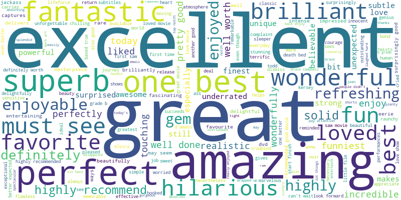
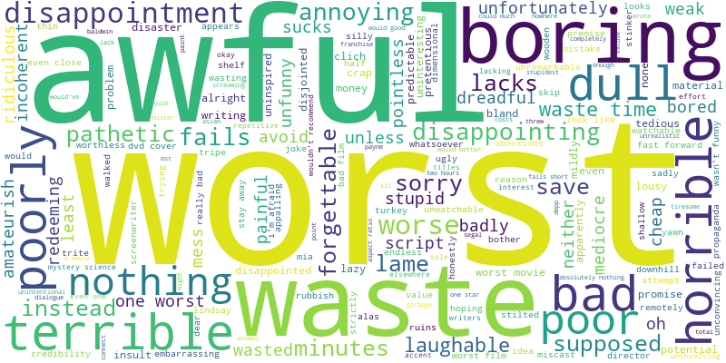
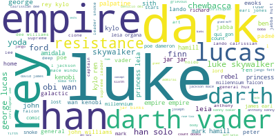
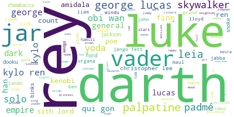

# IMDB Movie Review Classification #

* Morgan Didjurgis
* Flex 40 weeks
* Instructor: Abhineet Kulkarni

## Overview ##

This project builds a binary text classification model to identify whether IMDB reviews are positive or negative.

### Business Understanding ###

Sentiment analysis can help businesses find positive and negative customer feedback on their products.  The ability to classify a movie review as positive or negative can be used in a similar way, allowing for overall descriptive analysis of audience reception as well as further analysis of what drove either positive or negative reviews.  

IMDB star ratings are often inflated, so it can be challenging to rely on these numbers alone to classify reviews. Furthermore, this model could be applied to reviews where there is no star rating available.

### Data Understanding ###

The data set used to build this model came from __[Kaggle](https://www.kaggle.com/datasets/yasserh/imdb-movie-ratings-sentiment-analysis)__ and has ~40k reviews labeled either positive or negative. The classes are evenly balanced and there is no other metadata provided with the reviews and labels. 

### Approach ###

For text classification, there are many options when it comes to how to preprocess the data and which models/hyperparameters to use.  In order to test various preprocessing methods, I built a Preprocess class that allowed me to conduct a grid search through different combinations of preprocessing and apply them to a few different models during the training stages.  

Training was conducted with data vectorized in three different ways: Count, TFIDF, and Mean Word Embeddings 
and then results were compared.  Other preprocessing steps that were tried include whether to stem or lemmatize the words, max_df values, and chi squared feature selection.

I used the data to train Naive Bayes, Logistic Regression, Support Vector Machine, and XGBoost gradient boosting models.  Ultimately, Logistic Regression with TFIDF vectorization performed the best and I conducted a gridsearch to tune the hyperparameters for this model.

## Model Selection ##

The best performing model used TFIDF Vectorization, no stemming or lemmatization of the words, max_df of .6, chi-squared feature selection including up to the 60th percentile, and logistic regression with l2 regularization C=5 and the saga solver.

While more complex models exist for this task, such as using transfer learning on transformer based models like BERT, the Logistic Regression model achieved an accuracy of 90%. For our purposes, this is a good score and using logistic regression allows us to more easily interpret the model to understand which words/features are most important to a positive or negative classification.

Accuracy was the metric used to grade model performance since this is a balanced dataset with no reason to prefer avoiding false negatives or false positives.  Ultimately, all the metrics performed well and the AUC of the final model is .96.

## Feature Importances ##

We can use the coefficients from the final logistic regression model to evaluate feature importances.  Highly positive coefficients indicate features important for positive classification while large negative values indicate ones important for negative classification.  Below are word clouds built based on the magnitude of the logistic regression coefficients for both positive and negative reviews.

The word clouds built from coefficient values look as we may expect them to.  'excellent' is the most important word to indicate positivity while 'worst' is the best indicator for negativity.

These word clouds don't provide a lot of insight into what causes the reviewer to like or dislike the movie (although some things can be gleaned from the smaller words)...they are more useful to see how a reviewer expresses either positive or negative feelings.

## Example Use Case ##

The model was used to classify over 200 reviews of the nine main Star Wars movies as either positive or negative. 

### Comparison with Numeric Rating Scales ###

IMDB Star Ratings are known to have a tendency to be inflated with high average scores.  For these Star Wars movie reviews the average rating for positive reviews was 8.0 while the average rating for negative reviews was 6.0.  The distribution of positive reviews is left skewed while the negative reviews are normally distributed around 6.  This does follow the expectation that actual star ratings tend to be high and shows why a separate method for distinguishing between positive and negative reviews based on their text is useful.

### Character Mentions in Positive vs. Negative Reviews ###

Reviews were grouped based on their classification and then all the text was removed other than words relating to character names. I scraped a list of names off the Wikipedia listing of Star Wars characters in order to create a 'vocabularly' for inclusion.  Then, word clouds were plotted for both negative and positive reviews based on frequency of words in the Star Wars character vocabulary.  

This is not a perfect method, since it doesn't take into account the aspect from which the characters were mentioned.  There could be negative comments about a character in a positive review and vice versa.  However, it does give a baseline understanding of which characters were discussed more in each type of review.  For instance, Rey was more prominent in negative reviews while Luke was more prominent in positive reviews and  Han Solo is mentioned far more often in positive reviews.

# Conclusions #

We built a binary text classification model using TFIDF Vectorization, Chi squared feature selection, and Logistic Regression that classifies IMDB movie reviews as positive or negative with 90% accuracy.

Word Clouds were plotted to show which words are the most important to the model for indicating that the review is positive or negative.

Lastly, we downloaded new movie reviews to classify with our final model. The results were used to evaluate whether our model aligns with the IMDB star ratings (negative reviews still had a relatively high average of 6) and to see which words/characters were mentioned most often in both the positive and negative reviews.  This could be done with a certain genre as well to evaluate what has made movies successful when writing a business or marketing plan.

## Next Steps ##

* Use transfer learning to apply more sophisticated models to the problem
* Obtain labels for multiclassification to refine the sentiment classification (add neutral label)
* Apply more sophisticated sentiment analysis that can determine more specifically what was positive or negative about the review (aspect-based sentiment analysis)